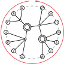

# PC-Trees

This is a C++ implementation of the **PC-tree** datastructure for representing cyclic permutations subject to *consecutivity* constraints, that is, requiring certain sets of elements to appear uninterrupted by elements from their complement sets.
See the image to the right (and its explanatory title text) for an example of a PC-tree, or [pref.tools/pqtree](https://pref.tools/pqtree) for an interactive online version.
The PC-Tree was first introduced by Hsu, Shih, and McConnell \[1, 2, 3\] and this union-find based variant of it was found to be the by-far fastest correct implementation \[4\].
If you want more backgrounds on the PC-tree datastructure, see this [Wikipedia article](https://en.wikipedia.org/wiki/PQ_tree) and the thesis \[5\].

A longer- and also better-known, related datastructure is the **PQ-tree**, which in a similar way represents linear permutations.
In fact, PQ- and PC-trees are linear-time equivalent \[2, 6\] and especially a PQ-tree can be simulated without overhead through
a PC-tree by adding one extra leaf that is part of no restriction and at which the circular order can be cut into a linear one.
See the `is_circular` flag [here](https://github.com/N-Coder/pqtree.js/blob/main/wasm/glue.cpp) for an example of this simulation.
A common application of PQ- and PC-trees is testing for the *(circular) consecutive ones property* of binary matrices,
where each column is represented by a leaf and, for each row, all 1's are turned into one consecutivity constraint.
See the `setRestrictions` method [here](https://github.com/N-Coder/pqtree.js/blob/main/wasm/glue.cpp) or the code below for examples.

While the [code of this library](https://github.com/ogdf/ogdf/tree/master/src/ogdf/basic/pctree) is also [available](https://ogdf.netlify.app/classogdf_1_1pc__tree_1_1_p_c_tree.html) through the [OGDF library](https://github.com/ogdf/ogdf), 
this stand-alone version has no dependencies and only uses [bandit](https://github.com/banditcpp/bandit) and [Dodecahedron::Bigint](https://github.com/kasparsklavins/bigint) for testing.
If you are looking for the older evaluation code from \[4\], you can find it in the [UFPCPaper](https://github.com/N-Coder/pc-tree/tree/UFPCPaper) branch.
Similarly, the older non-union-find-based HsuPC implementation can be found in the [HsuPCSubmodule](https://github.com/N-Coder/pc-tree/tree/HsuPCSubmodule) branch.
As the OGDF, this code runs on all major platforms (Linux, Apple and Intel Silicon macOS, Windows) and furthermore
also supports usage as Python or JavaScript (wasm) library, see below.

## Examples

```c++
std::vector<PCNode*> leaves;
PCTree tree(7, &leaves);

// the tree allows any order of its leaves
assert(tree.isTrivial());
assert(tree.possibleOrders<int>() == factorial<int>(6));
assert(tree.uniqueID(uid_utils::nodeToPosition) == "7:(6, 5, 4, 3, 2, 1, 0)");

// now we can force some leaves to be consecutive in all represented orders
// this is equivalent to a circular consecutive ones matrix with a single row:
//    0 1 2 3 4 5 6
// 0: 0 0 0 1 1 1 0
bool res = tree.makeConsecutive({leaves.at(3), leaves.at(4), leaves.at(5)});
assert(res == true);
assert(tree.getPNodeCount() == 2);
assert(tree.possibleOrders<int>() == factorial<int>(3) * factorial<int>(4));
```
See the [examples folder](./examples) for more code and also an example CMake configuration for using this library.
Documentation can be found within the [OGDF docs](https://ogdf.netlify.app/classogdf_1_1pc__tree_1_1_p_c_tree.html).
The library+example can be built as follows:
```bash
git clone --recursive https://github.com/N-Coder/pc-tree.git
cd pc-tree
# build the (shared) library in debug mode
mkdir build-debug && cd build-debug/
cmake .. -DCMAKE_BUILD_TYPE=Debug -DBUILD_SHARED_LIBS=ON
make -j 8
# run the tests
./test
./test-auto

# now build and run the example
cd ../examples/
mkdir build-debug && cd build-debug/
cmake .. -DCMAKE_BUILD_TYPE=Debug -DPCTree_DIR=../build-debug
make -j 8
./example # will print "1 2 3 8 7"
```

### Python
After compiling the shared library as above, the PCTree can also be used from Python thanks to the awesome [cppyy](https://github.com/wlav/cppyy) library.
Alternatively, [ogdf-python](https://github.com/ogdf/ogdf-python) together with [ogdf-wheel](https://github.com/ogdf/ogdf-wheel)
also provide a prebuilt Python package including the PCTree.

```python
import cppyy
cppyy.add_include_path("./include")
cppyy.add_library_path("./build-debug")
cppyy.include("pctree/PCTree.h")
cppyy.load_library("PCTree")
# or instead simply `from ogdf_python import *` and then use ogdf::pc_tree::PCNode/PCTree

leaves = cppyy.gbl.std.vector["pc_tree::PCNode*"]()
tree = cppyy.gbl.pc_tree.PCTree(7, leaves)
tree.isTrivial()
tree.possibleOrders["int"]()
tree.uniqueID()

tree.makeConsecutive([leaves.at(3), leaves.at(4), leaves.at(5)])
```

### JavaScript
See the [pqtree.js repository](https://github.com/N-Coder/pqtree.js) for examples on how to use this library from JavaScript, together with an interactive Website for working with (circular) consecutive ones matrices and PQ-/PC-trees.
Their [glue.cpp](https://github.com/N-Coder/pqtree.js/blob/main/wasm/glue.cpp) file contains many examples such as working with binary matrices,
simulating PQ-trees through PC-trees, counting and iterating admissible permutations, and drawing the trees.

## References

1. >Wei-Kuan Shih, Wen-Lian Hsu:
    A New Planarity Test.
    Theor. Comput. Sci. 223(1-2): 179-191 (1999)
    https://doi.org/10.1016/S0304-3975(98)00120-0

2. >Wen-Lian Hsu:
    PC-Trees vs. PQ-Trees.
    COCOON 2001: 207-217
    https://doi.org/10.1007/3-540-44679-6_23

3. >Wen-Lian Hsu, Ross M. McConnell:
    PC trees and circular-ones arrangements.
    Theor. Comput. Sci. 296(1): 99-116 (2003)
    https://doi.org/10.1016/S0304-3975(02)00435-8

4. >Simon D. Fink, Matthias Pfretzschner, Ignaz Rutter:
    Experimental Comparison of PC-Trees and PQ-Trees.
    ACM J. Exp. Algorithmics 28: 1.10:1-1.10:24 (2023)
    https://doi.org/10.1145/3611653

5. >Simon Dominik Fink:
    Constrained Planarity Algorithms in Theory and Practice.
    University of Passau, Germany, 2024
    https://doi.org/10.15475/cpatp.2024

6. >Bernhard Haeupler, Robert E. Tarjan:
    Planarity Algorithms via PQ-Trees (Extended Abstract).
    Electron. Notes Discret. Math, Vol. 31 (2008)
    https://doi.org/10.1016/j.endm.2008.06.029.
